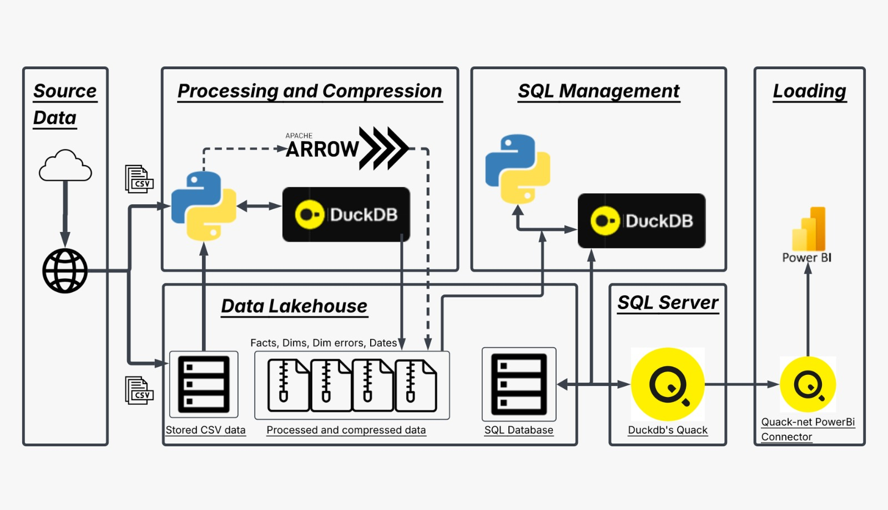
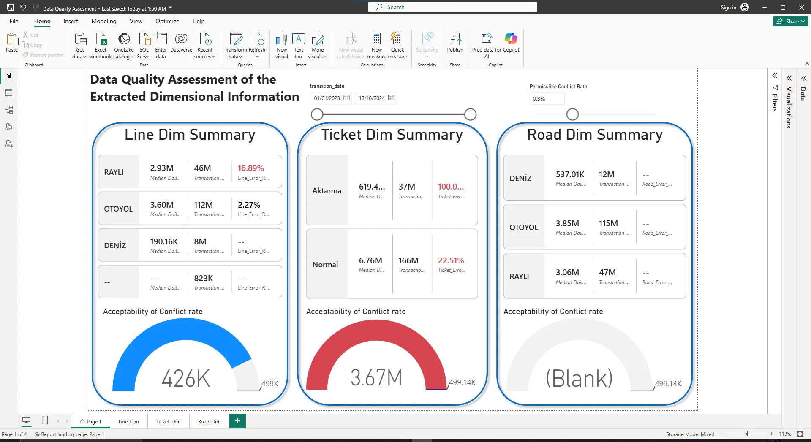
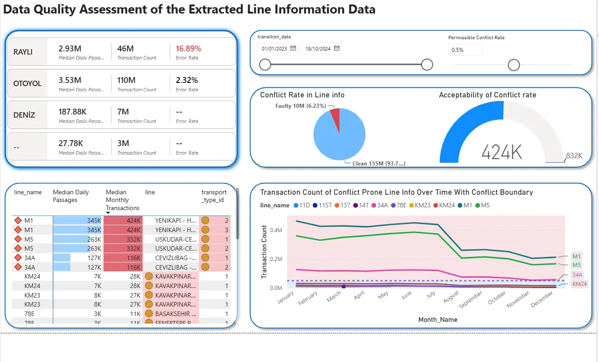
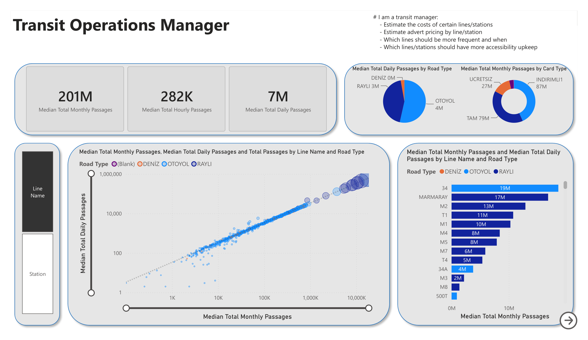
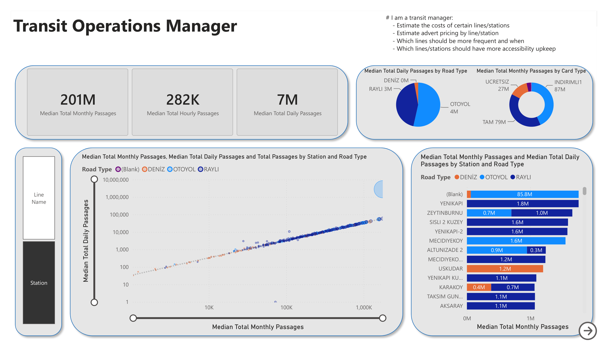
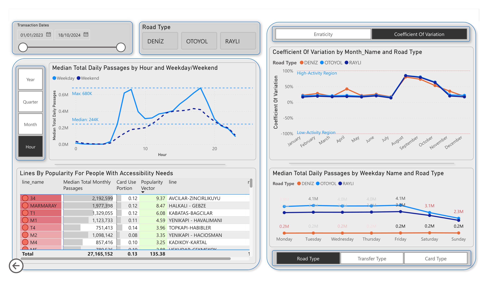
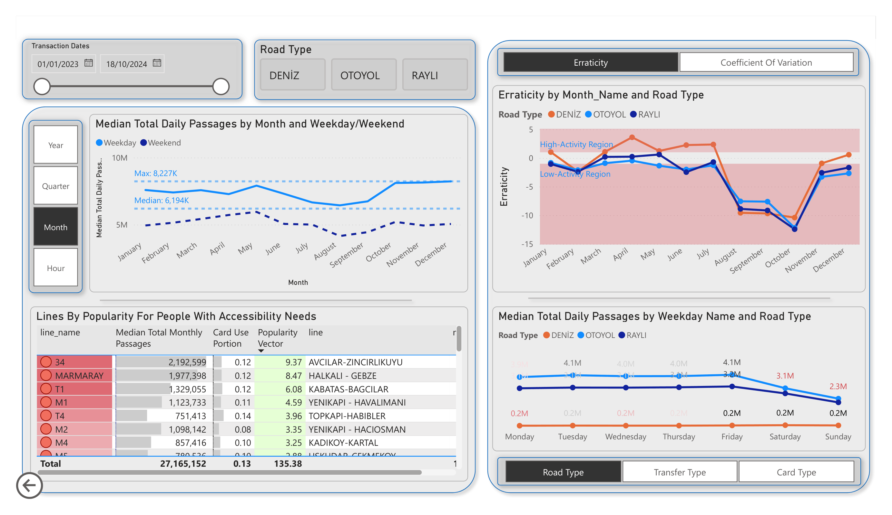
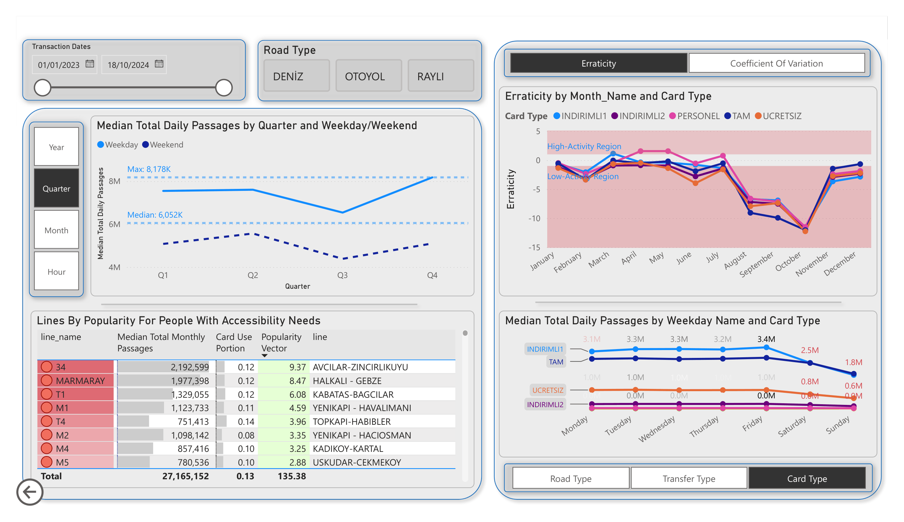
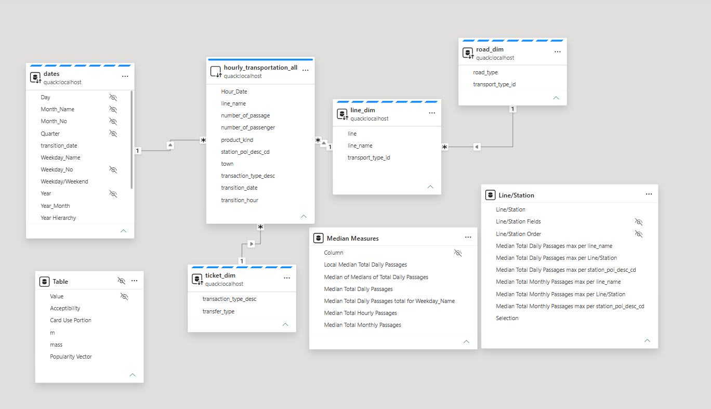

# Istanbul Transit Data Project

## Purpose & Method

**Challenge:** A metropolitan city like Istanbul is bound to have competitive costs of living, as well as running a business. While people are forced into commutes due to housing situations, and businesses need to manage their assets in a competitive market, management teams need to rely on gatherable data to make insights and forecast future trends.

**Solution:** An ETL pipeline can facilitate the collection of data from accessible sources, such as the [Hourly Public Transport Data Set](https://data.ibb.gov.tr/en/dataset/hourly-public-transport-data-set), storing data in a specialized format for direct use and quality assessment through the use of BI tools.

## Data Pipeline Architecture



## Data Source

The data used in this project was acquired from the Istanbul Metropolitan Municipality Open Data Portal. More specifically, it was acquired from the [Hourly Public Transport Data Set](https://data.ibb.gov.tr/en/dataset/hourly-public-transport-data-set). These datasets contain "passenger and journey data using public transportation in Istanbul in hourly terms." For the sake of this project, the datasets were retrieved in .CSV formats, processed and compressed, loaded into an SQL database, and finally visualized in Microsoft Power BI.

## Data Lakehouse

- **Stored CSV data:** These are manually selected and downloaded files.
- **Processed and compressed data:** These are exports, with up to **3200%** size compression, of the processing blocks to be used as ready-to-upload references, but are not meant to be loaded directly into BI tools.
- **SQL Database:** A database to be hosted by an SQL server to be queried by the BI tools.

## Data Extraction

- **Excel/Power Query**: By utilizing Power Query for web scraping, we can keep a spreadsheet of all the available datasets as well as some additional information, such as: Month, Year, ID, and the Download URL of the dataset.
  - Also included is a local query of processed datasets.
- **Manual Download:** The pipeline is built to support the usage of manually downloaded .CSV files, but it is optional.
- **Python Requests:** By using the Pandas library, we retrieve the Download URLs of the datasets from our tracker spreadsheet. Then we pass it into a GET request using the Requests library to query for the .CSV data.

## Data Processing

- **Python + DuckDB:** The .CSV data is either loaded or streamed into Python memory using the DuckDB library, after which it undergoes a few operations:
  - **Pulling Dims:** The dimensional features are extracted and separated into their respective files by dataset.
  - **Cleaning:** The unnecessary columns are removed and the rows of data are aggregated to reduce the dataset's size.
  - **Exporting:** The produced facts table is exported into a compressed file for long-term storage.
- **Apache Arrow:** When the dataset is too large and DuckDB fails to export it using the default parameters, it is streamed into Apache for exporting by chunks.

## Compression Effectiveness

The pipeline reduces storage significantly by cleaning raw CSVs and exporting compressed parquet. Using the data set of May 2024, example file-level results from the pipeline are shown below:

| Stage             | File size (bytes) | Compression vs raw CSV |
| ----------------- | ----------------: | ---------------------: |
| Raw CSV           |         1,772,334 |               **1.0x** |
| Cleaned CSV       |           537,687 |              **3.30x** |
| Cleaned Parquet   |            55,387 |              **32.0x** |
| Compressed Export |           140,300 |              **12.6x** |

## SQL Management

- **Python + DuckDB:** The processed files are loaded to update the Server's database.
- **[DuckDB's Quack](https://duckdb.org/quack/):** The Server is hosted through the Quack Remote Protocol (DuckDB's native remote execution protocol) using Python + DuckDB as the hosting interface.

## Loading

- **[Quack-Net Power BI Connector](https://github.com/CurtHagenlocher/quack-net):** Power BI does not have a native connector for DuckDB's Quack Remote Protocol, so we make use of this third-party connector to stream the data using DirectQuery.
- **Microsoft Power BI:** The BI tool we used to create visuals in this project.

---

# Python Script Quick Start

## Prerequisites

- Python 3.8 or higher
- Windows OS (commands provided are Windows-specific)
- All dependencies listed in `requirements.txt`

## Installation & Setup

1. Install required packages:

```cmd
pip install -r requirements.txt
```

2. For default settings, run all cells in sequence.

## (Optional) Script Parameters

Certain modifications can be made in these sections:

- **Year Range:** The range of years to process.
- **Import/Export Settings:** Change how files are imported/exported.
- **Facts Table Configuration:** Which columns are to be included in the facts table, and which to be aggregated across.
- **Dimension Tables:** The name and columns of the dimension tables.

## File Loading and Processing

- **`predownloaded_CSV(file_address)`** - Loads a file from local machine address, processes it, and exports it.
  - `process_all_preloaded()` - Runs for all available local files.

- **`query_CSV(query)`** - Requests a file by query, processes it, and exports it based on a tracker spreadsheet row.
  - `process_all_queries()` - Runs for all retrievable data.

- **`priority_based_looker(row, priority_sorted_columns=['File_Path', 'CSV_URL'], reprocess=False)`** - For a Pandas row passed from the tracker spreadsheet:
  - Modify `priority_sorted_columns` to reorder which columns are checked first.
  - Set `reprocess=True` to enable overwriting existing exports.

## SQL Database Updating

- **`priority_based_sql_loader(priority_sorted_columns=[predownload_export, query_export], reload=True, partition=None)`**
  - Change `priority_sorted_columns` order to favor certain export types.
  - Set `reload=False` to prevent overwriting existing tables.
  - Set `partition="Month"` or `partition="Year"` to partition datasets by time instead of grouping them together.

- **`dims_loader(sheet_names=["ticket_dim", "line_dim", "road_dim"])`** - Directly adds dimension tables to the database from an Excel file containing dims in separate sheets.

## SQL Server Launching and Terminating

- `quack:localhost` - Modify this to change the hosting address.
- `super_secret` - Modify this to change the authentication token.

---

# Data Quality Assessment



When looking at the summaries of the extracted dimension information, a few quick insights come to mind:

1. The dataset has mismatched dimensions in a notable portion of its rows.
2. The **Line Dimension** has many mismatches, but the data is acceptable unless analyzing the "RAYLI" category specifically.
3. The **Ticket Dimension** is too error-prone for direct analysis without correction.
4. The **Road Dimension** is free of any conflicting dimensional properties.



When browsing the detailed dashboard page, we can dive deeper into possible regions of conflict and determine where to direct attention. This example of the **Line Dimensional** information offers such insights:

- **~16.9%** of the RAYLI data is cause for error. Filtering reveals problems lie in lines M1 and M5, which have two entries each for different transport_type_id (listed as RAYLI and as either Deniz or Otoyol).
- **~2.3%** of the Otoyol data is cause for error. Line 34A has two entries for different transport_type_id, while others have different entries for different line routes.
- When the Permissible Conflict Rate is **0.5%**, the only lines worth addressing are **M1, M5, and 34A**, in that order.

## Transport Type Definitions

- **RAYLI:** Rail-based transport (Metro, Tram, Train)
- **Otoyol:** Bus-based transport
- **Deniz:** Ferry/Maritime transport

---

# Transit Operations Manager Dashboard

In Istanbul, a significant portion of the population relies heavily on the public transportation system to commute around the city. A transit operations manager is expected to provide adequate routes and maintain acceptable quality-of-life standards for passengers, regardless of status. This dashboard uses Hourly Transportation data from 2023-2024 to answer key operational questions.

## Key Measures

The following measures are frequently used in graph axes and are worth explaining:

- **Median Total Hourly Passages:** The number of passages collected in one-hour windows, with the median calculated across these bins.
- **Median Total Daily Passages:** The number of passages collected in one-day windows, with the median calculated across these bins.
- **Median Total Monthly Passages:** The number of passages collected in one-month windows, with the median calculated across these bins.
- **Use of Medians over Averages:** Medians make insights more robust against outliers and varying sample sizes. Comparing Median Total Daily and Monthly Passages quickly detects outliers between day-to-day windows.
- **Coefficient of Variation:** The standard deviation of the passenger count divided by the average, showing relative variability by category.
- **Erraticity:** The ratio of (Median Total Monthly Passages) to (Median Total Daily Passages - 30). This shows the rate and direction of skewness in median daily passages by grouping categories.
- **Popularity Vector:** A measure showing how popular a line is with a certain card type: (Popularity of line among all lines) × (Proportion of transactions by a specific card type).

## Transit Info Summary



### Passenger Volume

- **How many passengers can be expected per hour, day, or month?**
  - The median passages: **282K per hour**, **7M per day**, and **201M per month**. More specific information is available when filtering for certain lines or stations.

### Distribution by Transport Type

- **How are passages distributed across types of transport?**
  - **~57%** of daily passages are on Otoyol (bus) lines
  - **~43%** of daily passages are on RAYLI (rail) lines
  - Deniz (ferry) lines account for negligible traffic

### Most Common Card Types

- **What are the three most common card types?**
  - **INDIRIMLI1** (**~43%** of monthly transactions) - Discounted card for students, teachers, and seniors 60+
  - **TAM** (**~39%** of monthly transactions) - Base, undiscounted card available to all
  - **UCRETSIZ** (**~13%** of monthly transactions) - Free pass for mothers, disabled individuals, veterans, and seniors 65+

### Line and Station Analysis

When sorting by Line Name and Station Name:

- **Top 5 most used lines:** 34, Marmaray, M2, T1, and M1 (mostly RAYLI lines)
- **Distribution pattern:** Most passages occur on a handful of lines; most RAYLI lines have high passages with low erraticity; Otoyol passages spread across many lines with lower volumes but notable erraticity, except for lines 34 and 34A (metrobus), which behave like RAYLI lines.

---



- **Top 5 most used stations:** Yenikapi, Zeytinburnu, Sisli 2 Kuzey, Yenikapi-2, and Mecidiyekoy
- **Station observation:** Most Otoyol transactions lack station names. Deniz stations either have very high or very low passenger counts compared to other line types. RAYLI stations are more spread out in use but sit on the higher end of total passengers.

---

## Transit Info Deep Dive



### Peak Traffic Hours

- **Weekdays:** Peaks at 8:00 AM and 6:00 PM (corresponding to 9-5 workday)
- **Weekends:** Lower peaks around 12:00 PM and 6:00 PM

### Seasonal Variation

- **High variations** (**~80%** relative to mean) occur around August
- **Decline** by the end of November

### Day-of-Week Effects

- Weekdays maintain relatively similar values regardless of line type
- Weekends see dips in Otoyol and RAYLI, while Deniz lines see increased use

### Accessibility Infrastructure Needs

- **Top 5 lines requiring accessibility focus** (filtered for "UCRETSIZ" card users, sorted by the joint probability "Popularity Vector"): **34, Marmaray, T1, M1, and T4**

---



### Monthly Traffic Patterns

- **Highest traffic months:** May and October weekdays (~8.2M median, **+17%** from global median)
- **Lowest traffic month:** August (~6.3M median, **-10%** from global median)
- **Erraticity pattern:** August-September show highly negative erraticity, indicating skewness toward low-activity daily medians

---



### Cross-Category Insights

- Erraticity and daily passages exhibit similar behaviors when grouped by card type instead of transport type
- This suggests activity causes are not dependent on the grouping category

---

## Transit Info Relationship Model



The star schema model includes the following cached and queried tables from the Quack Server:

| Table                         | Type        | Description                                                                             |
| ----------------------------- | ----------- | --------------------------------------------------------------------------------------- |
| **dates**                     | Cached      | Contains dates and metadata (transition_date as PK, day number, month name, year, etc.) |
| **line_dim**                  | Cached      | Line information (line name as PK, line route, line type as FK)                         |
| **road_dim**                  | Cached      | Line type information (index as PK)                                                     |
| **ticket_dim**                | Cached      | Transaction type information (transaction_type_desc as PK, transfer_type)               |
| **hourly_transportation_all** | DirectQuery | Facts table queried from the server using DirectQuery                                   |

For detailed column information, see the [Hourly Public Transport Data Set](https://data.ibb.gov.tr/en/dataset/hourly-public-transport-data-set).

---

# Troubleshooting

- **DuckDB export failures on large datasets:** Use Apache Arrow for chunked exporting (see Data Processing section)
- **Power BI connection issues:** Verify Quack-Net connector is properly installed and authentication token matches server configuration
- **Mismatched dimensions:** Refer to Data Quality Assessment section for identified problem lines and corrective actions
